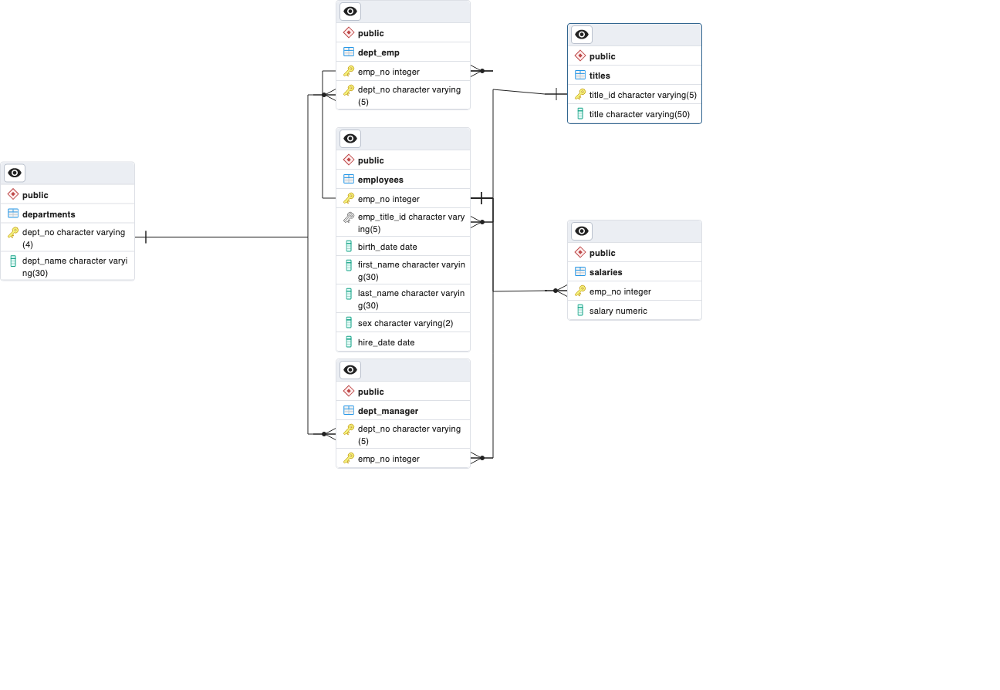

# sql-challenge

## Data Modeling

Looking through the csv files, six different tables of various length were identified: departments, titles, dept_manager, dept_emp, employees, salaries. 

The departments table has two columns (dept_no, dept_name) and dept_no was established as the primary key. Both columns are VARCHAR, with dept_no having a length of 4 characters and dept_name being provided 30 characters. The table is a parent table linked to the dept_manager and dept_emp tables.

The dept_manager table has two columns (dept_no, emp_no) and both dept_no and emp_no were established as primary keys to make a composite key. Column dept_no is VARCHAR of 4 and emp_no is INT. This table acts as a hub, allowing queries to move from departments to employees and dept_emp.

The dept_emp table has two columns (dept_no, emp_no) and both dept_no and emp_no were established as primary keys to make a composite key. Column dept_no is VARCHAR of 4 and emp_no is INT. This table acts as a hub, allowing queries to move from departments to employees and dept_manager through the use of foreign keys.

The employees table has 7 columns, the most of any table, and it stores much of the employee information, from their names and hire date to their sex and birth date. The columns associated with dates take DATE values while all of the other employee data is stored as VARCHAR. The emp_no column is INT and is the primary key for this table. It also acts as a foreign key to access the dept_manager and dept_emp columns.

The salaries table has two columns, emp_no and salary. The salary column is an INT within the csv file but was added as numeric to provide a more realisitic value for salary. Emp-no, the primary key, also acts as the foreign key to link back to employees table.

The titles table has two columns, title_id and title. The title column is VARCHAR with a length of 50. Title_id, the primary key, also acts as the foreign key to link back to employees table through emp_title_id.

